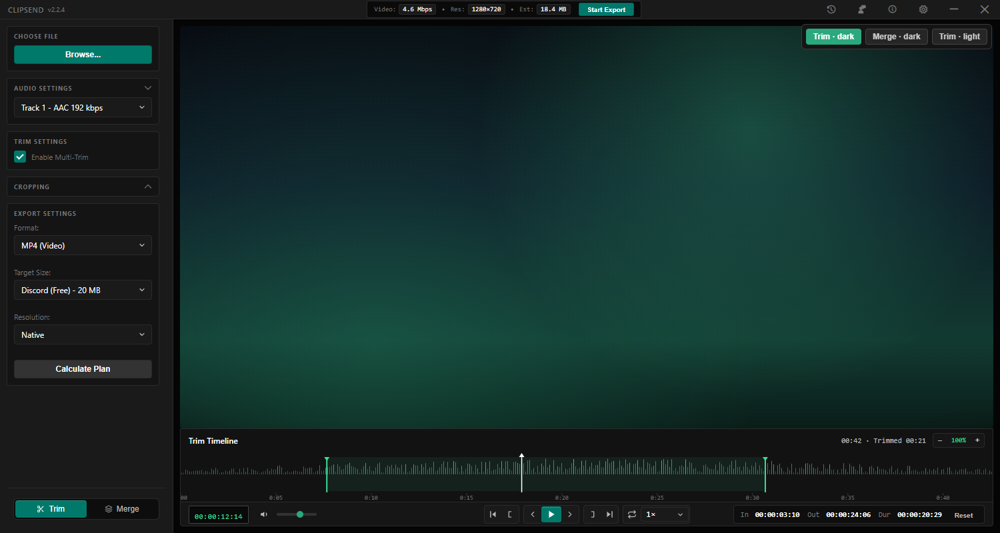
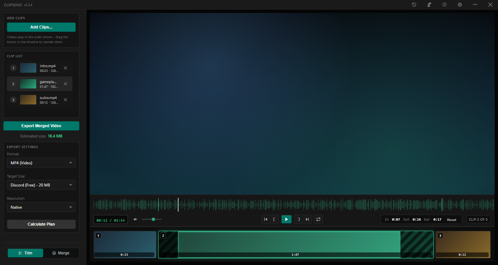
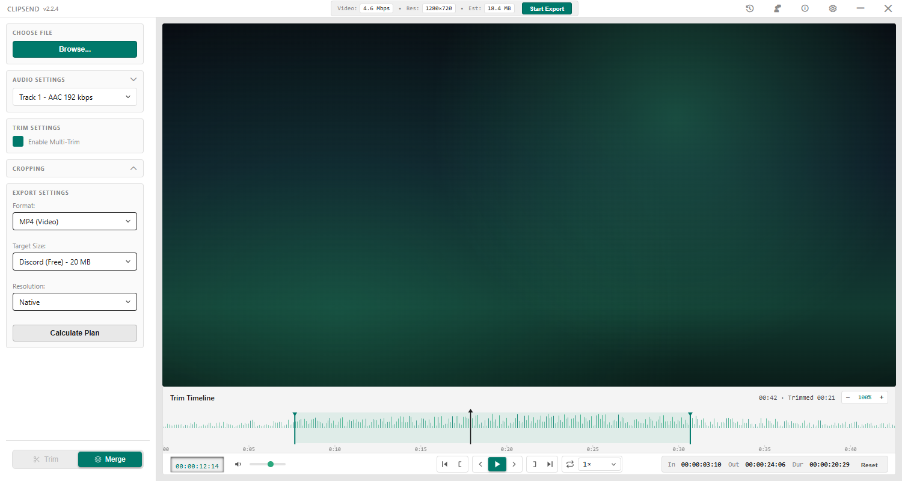

# ClipSend

## App Overview
ClipSend is a Windows desktop app for cutting video down to size: trim a single clip, merge several into one, and export to fit Discord's 20 MB free tier, 50 MB Nitro Basic, or 500 MB Nitro. Exports are GPU-accelerated where possible (NVENC, QSV, AMF), fall back to the CPU otherwise, and use H.264 or AV1.

  

## Tech Stack
- **Framework:** Electron (Target Platform: Windows)
- **Frontend UI:** Vanilla JavaScript, HTML5 Canvas (for timeline rendering), and pure CSS
- **Backend/Processing:** Node.js, FFmpeg & FFprobe (bundled binaries)
- **Settings Persistence:** `electron-store`

## Features

### Trim Mode
Trim Mode loads one video, lets you set in and out points, and exports a compressed clip of just that section.
- **File Loading:** Supports both native file dialog selection and dragging/dropping a file directly onto the window.
- **Timeline:** A custom `<canvas>`-based interactive timeline with visual waveform/thumbnail support, draggable in/out trim handles, and a playhead synchronized with the `<video>` element.
- **Audio Controls:** Pick a specific audio track from a multi-track video, or mute it and adjust volume. The choices persist across sessions.
- **Export Estimation:** Calculate Plan works out the expected file size and bitrate for the chosen preset before you start the encode.
- **Copy to Clipboard:** After a Trim Mode export, a Copy to Clipboard button puts the exported file itself on the clipboard (native Windows `CF_HDROP` via PowerShell's `Set-Clipboard`), so you can paste it straight into Discord, Slack, or Windows Explorer.
- **Transport Bar:** Unified flat styling for the playback controls (Play/Pause, Step Frame, Jump to Marker, Set Marker), using Segoe MDL2 icon fonts.

### Merge Mode
Merge Mode takes several clips, arranges them in order, and stitches them into one video.
- **Multi-clip Loading:** Add several clips at once through the Add Clips dialog, or drop multiple files onto the stage or the Clip List sidebar.
- **Clip List Panel:** A visual sidebar of all loaded clips. Reorder clips with native HTML5 drag and drop.
- **Proportional Timeline:** The timeline scrubber draws segments proportional to each clip's duration. Very short clips get a minimum visual width so they stay clickable, with a non-linear mapping that keeps the playhead accurate.
- **Per-Clip Trimming:** Trim each clip in the merge timeline independently. Drag the amber handles on a block, or select a clip and use the Set In / Set Out / Jump transport buttons. Cut-away regions are dimmed, blocks scale to their trimmed length, and the preview player honors the trims during playback and scrubbing.
- **Continuous Playback:** The video source swaps as the playhead crosses clip boundaries. Volume and mute states carry over from clip to clip.

### Mode Switching
- Switch between Trim Mode and Merge Mode without losing any state.
- **Implementation Detail:** When returning to Trim Mode, the UI forces a `window.resize` event dispatch. This is required because HTML5 `<canvas>` elements lose their dimensional context and render blank after being hidden via `display: none`; the resize event triggers a safe re-measure and repaint of the timeline using the preserved in-memory state.

### Drag-and-Drop System
ClipSend supports dragging and dropping files from the OS directly into the app.
- **Path Resolution:** Under `contextIsolation: true`, the `.path` property on DOM `File` objects is stripped. ClipSend uses the Electron 32+ `webUtils.getPathForFile(file)` API, exposed through `preload.js`, to get the real absolute path of a dropped file.

### Export Pipeline
Every export runs on the bundled FFmpeg. A planning step first works out the encode (bitrate, resolution, encoder, exact arguments), then the encode runs and reports progress.
- **Planning (`export-planner.js`):** Works out the video bitrate that lands under the chosen size cap. It keeps a safety margin below the limit (tighter for short clips, where keyframe overhead eats a bigger share), sets aside 1.5% for the container, subtracts the audio bitrate, and produces the exact FFmpeg arguments.
- **Hardware Acceleration (`encoder-profiles.js`, `encoder.js` & `merger.js`):** NVIDIA NVENC (`h264_nvenc`), Intel QSV (`h264_qsv`), and AMD AMF (`h264_amf`) are detected from the bundled FFmpeg and selectable in Settings. Rate control is adjusted per encoder (`-rc vbr`/`-maxrate` for size-targeted hardware exports instead of the 2-pass ABR used by CPU encoders).
- **AV1 Exports:** A Video Codec setting switches exports from H.264 to AV1, roughly double the quality at the same file size. AV1 muxes into the format you pick (MP4 with AAC audio, or WebM with Opus), using SVT-AV1 (2-pass for size targets) on CPU or the GPU's AV1 encoder (`av1_nvenc` / `av1_qsv` / `av1_amf`) when available.
- **WebM Exports:** The format picker includes WebM for web-friendly sharing (Slack, HTML5 embeds, browsers). WebM cannot contain H.264, so picking WebM with the H.264 codec setting exports VP9 (`libvpx-vp9`, software, 2-pass for size targets) with Opus audio; the AV1 setting exports AV1-in-WebM and keeps the hardware AV1 encoders. VP9 has no hardware encoder in this app, so WebM+H.264 exports run on the CPU (a plan warning calls this out).
- **Merge Fallback (`merger.js`):** When exporting merged clips, the pipeline tries a lossless fast path (`concat` demuxer with `-c copy`) if all clips share the same codecs, resolution, and framerate. If they differ, it falls back to a re-encode with the `concat` filter, normalizing every clip to the first clip's parameters and using NVENC when configured.
- **Merge Trimming (`merger.js`):** When any clip has a trim range, that clip is first re-encoded to a uniform temporary file (accurate `-ss`/`-t` trim, h264/aac, NVENC or CPU) before the concat step, so the merged output contains exactly the selected sections. Untouched clips keep the original files, and all temp files are cleaned up automatically. Progress is weighted across the trim + concat phases.

  

## Themes

ClipSend follows your Windows theme, with a dark and a light variant for every screen.

  

## Architecture Notes
- **Process Communication:** The application maintains strict isolation. The UI (`renderer/`) communicates with the Node.js backend (`main/`) exclusively via asynchronous IPC invocations defined in `preload.js` and handled in `ipc-handlers.js`.
- **FFmpeg Execution:** `Encoder` and `Merger` classes wrap the native Node.js `child_process.spawn`, parsing stderr text streams in real-time to extract timecode progress updates.
- **Two-Pass Path Workaround:** FFmpeg/x264 on Windows suffers from a long-standing bug where it fails to interpret backslashes correctly in the pass logfile path. ClipSend bypasses this by setting the Node child process `cwd` to the target output directory and using a relative filename (`ffmpeg2pass-0.log`) for the pass logs.

## Privacy & Updates

ClipSend's installer is unsigned, so Windows SmartScreen may show an "unrecognized publisher" warning when you install or update. Click More info, then Run anyway. The auto-updater works without a signing certificate.

- [Privacy Policy](PRIVACY.md)

## Known Limitations / Future Work
- **Hardware Acceleration Fallback:** The export pipeline detects hardware encoder initialization failures (e.g. out of VRAM, missing drivers, or an unsupported GPU generation) and falls back gracefully to the matching CPU encoder (`libx264` for H.264, `libsvtav1` for AV1).
- **Single-Pass Hardware Encoder Restriction:** FFmpeg's hardware encoders (NVENC/QSV/AMF) do not support traditional 2-pass encoding, so size-targeted hardware exports use single-pass VBR. Hitting exact file size targets is slightly less accurate than the CPU 2-pass path; the CPU 2-pass path is always available by selecting CPU in Settings.
- **Hardware AV1 requires newer GPUs:** AV1 hardware encoding needs an RTX 40-series (or newer) GPU, an Intel Arc / 12th-gen+ iGPU, or an AMD Radeon RX 6000-series (or newer) GPU. On older GPUs the app automatically uses software SVT-AV1 instead, which is slower but produces the same file format.
